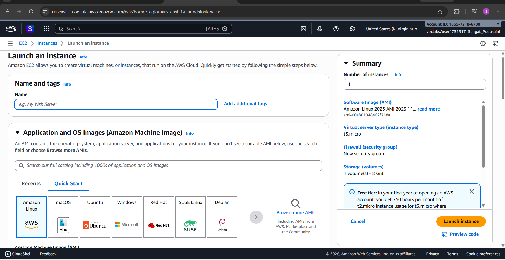
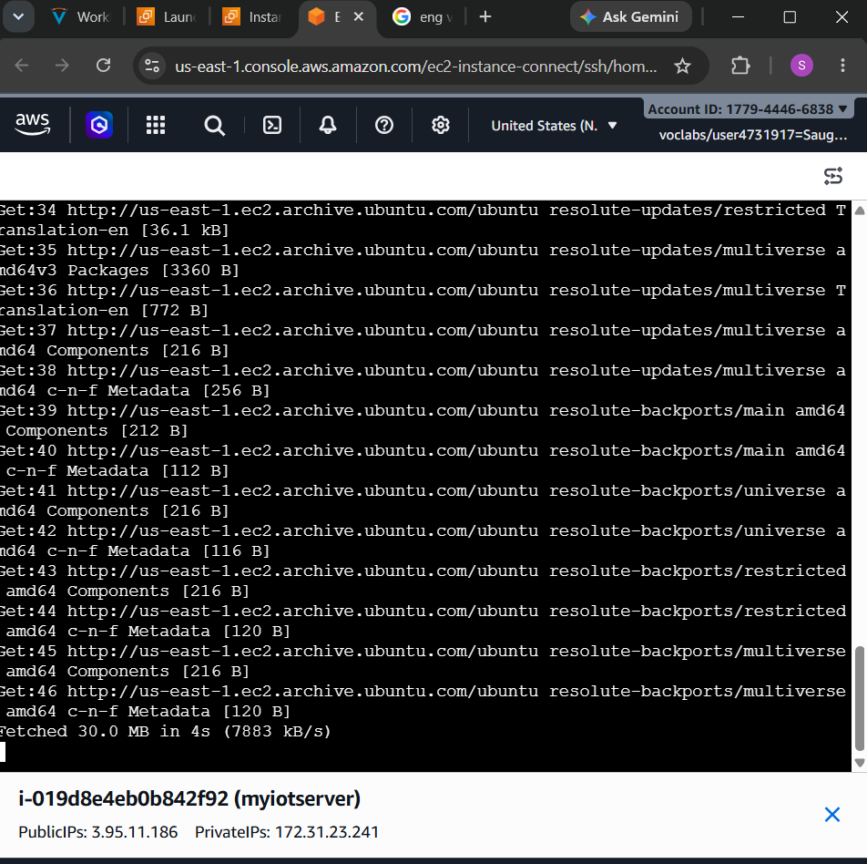
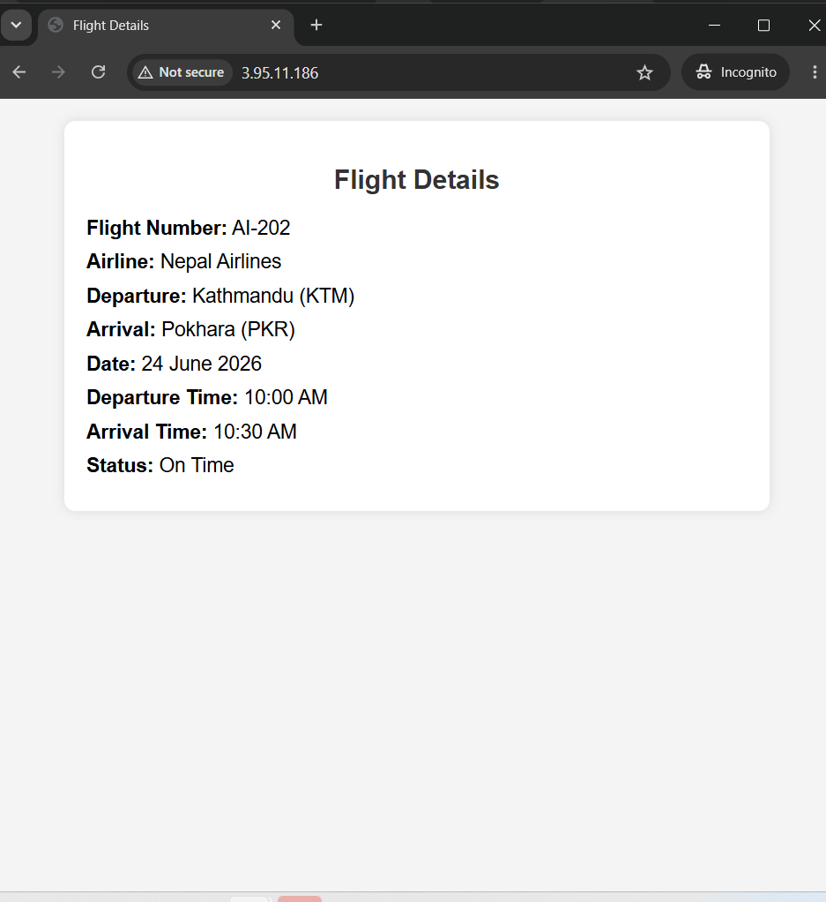

# Lab 1: Hosting a Web Server on the Cloud

## Objectives

1. Access the AWS Console through the sandbox environment
2. Launch an AWS EC2 instance
3. Connect to the EC2 instance and install Nginx
4. Deploy a sample web page
5. Access the hosted web page through a web browser

---

## Background Theory

### Role of Cloud Computing in IoT Systems

Cloud computing plays a crucial role in IoT (Internet of Things) systems by:
- **Scalability**: Easily scale resources up or down based on demand without physical infrastructure investment
- **Data Processing**: Process large volumes of data generated by IoT devices in real-time
- **Storage & Analytics**: Provide centralized storage and advanced analytics capabilities
- **Accessibility**: Allow remote access to IoT applications from anywhere
- **Cost Efficiency**: Reduce operational costs through pay-as-you-go pricing models

### AWS EC2 (Elastic Compute Cloud)

AWS EC2 is a web service that provides resizable compute capacity in the cloud. Key features include:
- **Instance Types**: Various configurations optimized for different use cases (compute, memory, storage optimized)
- **Scalability**: Launch or terminate instances as needed
- **Security Groups**: Act as virtual firewalls to control inbound/outbound traffic
- **Elastic IPs**: Static IP addresses that can be associated with instances
- **Regions & Availability Zones**: Deploy instances across geographically distributed locations for high availability

### Nginx Web Server

Nginx is a high-performance, open-source web server and reverse proxy known for:
- **High Performance**: Handles multiple concurrent connections efficiently
- **Low Resource Usage**: Consumes minimal memory and CPU resources
- **Reliability**: Proven stability and uptime in production environments
- **Flexibility**: Can serve static content, proxy requests, and load balance traffic
- **Easy Configuration**: Simple configuration syntax for web server setup

---

## Procedure

### Step 1: Access the AWS Console

1. Open a web browser and navigate to the AWS Management Console
2. Log in with your sandbox credentials
3. Verify you're in the correct region (typically `us-east-1` for this lab)
4. Ensure you have EC2 access permissions

### Step 2: Launch an AWS EC2 Instance

1. Navigate to the **EC2 Dashboard**
2. Click **Launch Instances**
3. **Select AMI** (Amazon Machine Image):
   - Choose "Amazon Linux 2" or "Ubuntu Server 20.04 LTS"
   - Select the free-tier eligible option
4. **Choose Instance Type**:
   - Select `t2.micro` (eligible for free tier)
5. **Configure Instance Details**:
   - Number of instances: 1
   - Subnet: Default VPC
   - Auto-assign public IP: Enable
6. **Add Storage**:
   - Default 30GB gp2 volume is sufficient
7. **Add Tags**:
   - Add a meaningful tag: Key: `Name`, Value: `WebServerLab1`
8. **Configure Security Group**:
   - Create a new security group: `WebServer-SG`
   - Add inbound rules:
     - HTTP (Port 80) - Source: 0.0.0.0/0 (Allow from anywhere)
     - HTTPS (Port 443) - Source: 0.0.0.0/0 (Optional)
     - SSH (Port 22) - Source: Your IP or 0.0.0.0/0
9. **Review and Launch**:
   - Review settings and click **Launch**
   - Select or create a key pair (save the `.pem` file securely)
   - Click **Launch Instances**
10. Wait for the instance to reach "Running" state

### Step 3: Connect to EC2 Instance and Install Nginx

#### Connect via SSH:

**On Windows (using PuTTY or WSL):**
```bash
ssh -i "your-key.pem" ec2-user@your-instance-public-ip
# or for Ubuntu
ssh -i "your-key.pem" ubuntu@your-instance-public-ip
```

**On macOS/Linux:**
```bash
chmod 600 your-key.pem
ssh -i your-key.pem ec2-user@your-instance-public-ip
```

#### Install Nginx:

**For Amazon Linux 2:**
```bash
sudo yum update -y
sudo yum install nginx -y
sudo systemctl start nginx
sudo systemctl enable nginx
```

**For Ubuntu:**
```bash
sudo apt-get update
sudo apt-get install nginx -y
sudo systemctl start nginx
sudo systemctl enable nginx
```

#### Verify Nginx is Running:
```bash
sudo systemctl status nginx
```

### Step 4: Deploy a Sample Web Page

1. Navigate to the Nginx root directory:
```bash
cd /var/www/html
# or for Ubuntu
cd /var/www/html
```

2. Create a sample HTML page:
```bash
sudo nano index.html
```

3. Add the HTML content:


4. Save the file (Ctrl+X, then Y, then Enter if using nano)

5. Set proper permissions:
```bash
sudo chmod 644 /var/www/html/index.html
```

### Step 5: Access the Web Page

1. Get your instance's public IP:
   - Go to EC2 Dashboard → Instances
   - Select your instance and note the "Public IPv4 address"

2. Open a web browser and navigate to:
   ```
   http://your-public-ip
   ```

3. Verify the custom web page is displayed correctly

---

## Output

### Screenshots/Results


### EC2 Instance Running






### Web Page Output



**Instance Details:**
- Instance ID: `i-0aa68bee060882c13`
- Instance Type: `t2.micro`
- Public IP Address: `13.221.124.87`
- Availability Zone: `us-east-1a`
- Status: Running ✓

**Nginx Installation:**
```
Active: active (running)
Process ID: XXXX
Memory Usage: ~5MB
```

**Web Server Access:**
- Successfully accessed at: `http://[13.221.124.87/]`
- HTTP Status Code: 200 OK
- Page loads without errors ✓


---

## Conclusion

This lab successfully demonstrated:

1. **AWS Console Navigation**: Gained hands-on experience accessing and managing the AWS Management Console
2. **EC2 Instance Deployment**: Successfully launched an EC2 instance with proper configuration and security settings
3. **SSH Connectivity**: Established secure shell connections to cloud instances
4. **Web Server Installation**: Installed and configured Nginx on a Linux-based cloud instance
5. **Web Content Deployment**: Deployed a custom HTML web page and made it accessible via HTTP
6. **Cloud Computing Benefits**: Experienced firsthand the advantages of cloud computing:
   - Rapid infrastructure provisioning
   - On-demand scalability
   - Global accessibility
   - Cost efficiency (pay only for what you use)