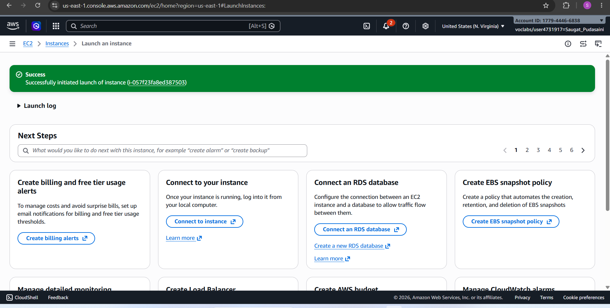
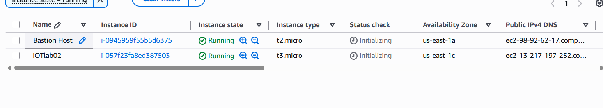
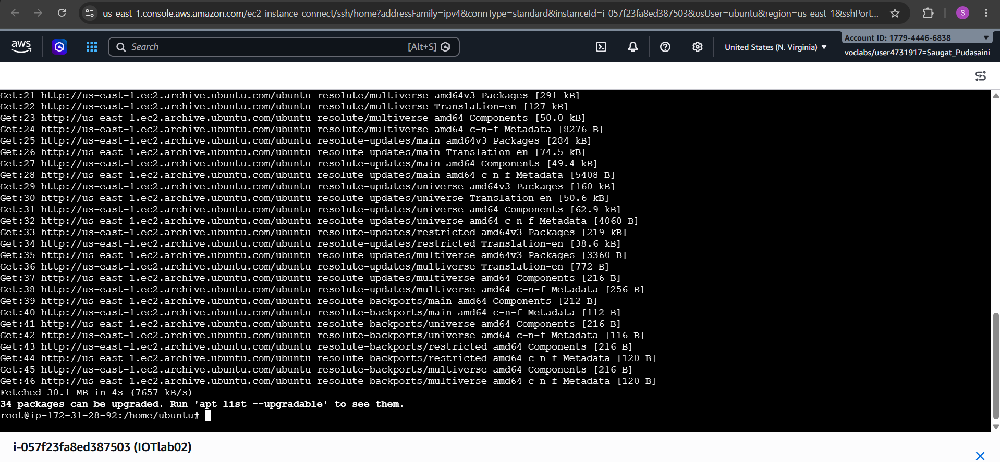
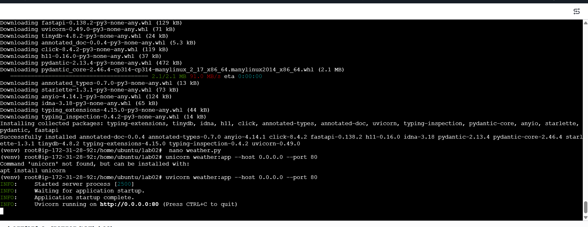
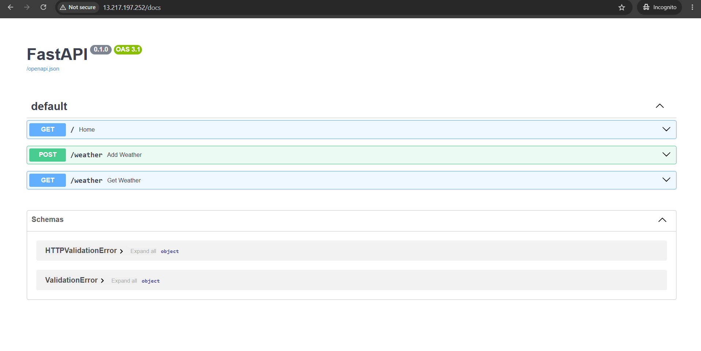
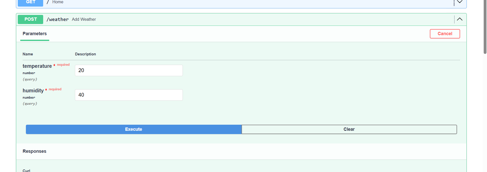

## Lab 2: Developing and deploying a REST API to store data on cloud

### Objectives

* Launch and configure an AWS EC2 instance
* Create a Python virtual environment (venv)
* Install FastAPI, Uvicorn, and TinyDB
* Develop REST API endpoints using FastAPI
* Store temperature and humidity data with timestamps
* Test GET and POST API endpoints
---

### Background Theory
 #### Cloud Computing in IoT Systems

Internet of Things systems often generate large amounts of sensor and device data. Cloud computing provides scalable infrastructure to:

 * Store IoT data
 * Process real-time events
* Run analytics and AI models
* Manage connected devices remotely
* Provide APIs for applications and dashboards

#### Benefits of cloud computing in IoT:

* Scalability
Remote 
*  accessibility
* High availability
* Centralized monitoring
* Real-time processing
* Lower hardware costs

#### Cloud platforms commonly used:

* Amazon Web Services
* Microsoft Azure
* Google Cloud
---

 #### AWS EC2 (Elastic Compute Cloud)

Amazon Web Services EC2 is a service that provides virtual servers in the cloud.

In IoT systems, EC2 can:

* Host APIs
* Run backend applications
* Process sensor data
* Store files and logs
* Connect with databases
* Run dashboards and analytics

#### Advantages:

* On-demand scalability
* Global deployment
* Flexible operating systems
* Pay-as-you-go pricing

---
#### REST API Architecture

REST is a standard architectural style for communication between clients and servers over HTTP.

REST APIs are widely used in IoT because devices can send and receive data easily using HTTP requests.

REST Principles
* Client-server architecture
* Stateless communication
* Resource-based URLs
* Standard HTTP methods

---
#### FastAPI Framework

FastAPI is a modern Python framework used to build fast REST APIs.

Why FastAPI is popular:

* Very high performance
* Easy API creation
* Automatic documentation
* Built-in data validation
* Async support

---

#### TinyDB Database

TinyDB is a lightweight document-oriented database written in Python.

It stores data in JSON format and is useful for:

* Small projects
* IoT prototypes
* Embedded systems
* Local storage

#### Advantages:

* No separate server required
* Simple to use
* Lightweight
* JSON-based storage

#### Limitations:

* Not suitable for very large systems
* Limited scalability compared to SQL/NoSQL databases

---
#### HTTP GET and POST Methods

HTTP methods define actions performed on resources in REST APIs.

#### GET Method

Used to:

* Retrieve data
* Read information from server

#### Characteristics:

* Safe
* Does not modify data
* Parameters often passed in URL

#### POST Method

Used to:

* Send data to server
* Create new resources
* Upload sensor readings

#### Characteristics:

* Modifies server data
* Sends data in request body
* Common in IoT sensor uploads
 ### Procedure
 * #### Step 1:  Open the amazon Awebservice and create the sandbox environment in the seperate window
 * #### Step 2: After this click on start lab icon after it is loaded click on AWS.
 * #### Step 3:Search for EC2 and click on it then launch the instance with ubuntu.
 * #### Step 4:Connect that instance and install and update necesary packages for running the code which include following syntax.
       
       sudo su

       apt update

       python3 --version

       apt install python3-pip python3-venv

       mkdir fastapi-lab

       cd fastapi-lab

       python3 -m venv venv

       source venv/bin/activate

       pip3 install fastapi uvicorn tinydb

       nano app.py

       uvicorn app:app --host 0.0.0.0 --port 80

* #### Step 5:After writing upto nano as in step 4 then write the code in that section , save that app.py file and exit from there.
#### Step 6: Write the last syntax as written in step 4
#### Step 7: Visit your website using the url provided and you can post or get the data there.

### Output
Through the URl provided by the AWS instance we can get and post the values by visiting that site using the URl.

### Conclusion
From this lab ,we came to know about AWS  instance through which the code is executed and URL provided by that instance can be visted and we can get and post the values.