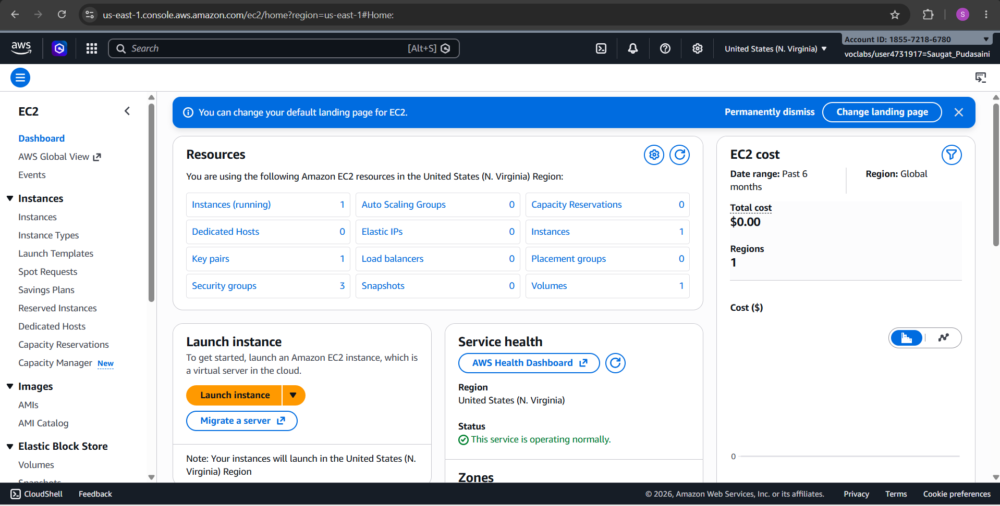
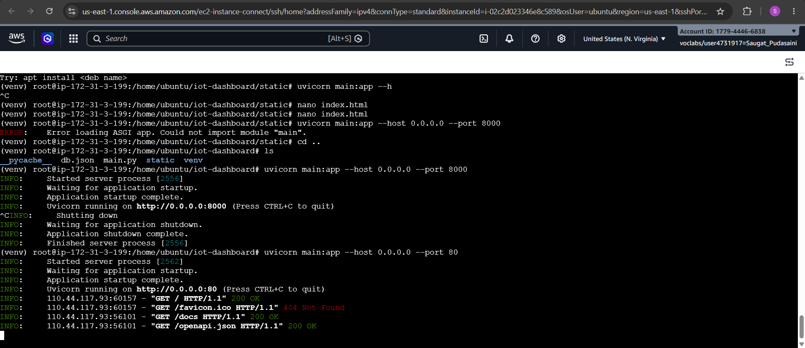
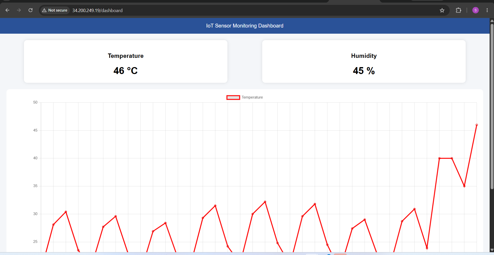

# Lab 3

## Title: Visualizing IoT Sensor Data Using Interactive Dashboards

---

## Objectives

> 1. Retrieve stored sensor data from the REST API developed in Lab 2.
> 2. Understand the importance of data visualization in IoT systems.
> 3. Develop a web-based dashboard to display sensor data.
> 4. Create real-time and historical visualizations of temperature and humidity data.
> 5. Deploy the dashboard on the AWS EC2 instance.
> 6. Analyze sensor trends using graphical representations.

---

## Background Theory

### Data Visualization in IoT
IoT systems generate continuous sensor data such as temperature and humidity. Raw data is difficult to interpret directly, so visualization techniques are used to convert it into meaningful charts and graphs for better analysis and monitoring.

### API Oriented Architecture
In this architecture, frontend applications communicate with backend services using REST APIs. This ensures separation of frontend and backend, making the system scalable and maintainable.

### Dashboard Systems
A dashboard is a visual interface that displays real-time and historical data in graphical form. It helps in monitoring system performance and analyzing trends efficiently.

### Designing Data Filters
Data filters allow users to query specific ranges or time periods of sensor data. Filtering improves performance and helps focus on relevant data points for analysis.

---

## Procedure

### Step 1: Launch AWS EC2 Instance
- Login to AWS Management Console
- Launch Ubuntu EC2 instance




### Step 2: Update System

```bash
sudo apt update && sudo apt upgrade -y
```

### Step 3: Install Required Tools

```bash
sudo apt install python3-pip python3-venv -y
```

### Step 4: Create Project Directory

```bash
mkdir iot-dashboard
cd iot-dashboard
```

### Step 5: Create Virtual Environment

```bash
python3 -m venv venv
source venv/bin/activate
```

### Step 6: Install Dependencies

```bash
pip install fastapi uvicorn tinydb python-multipart
```

### Step 7: Project Structure

```
iot-dashboard/
│
├── main.py
├── db.json
├── venv/
└── static/
    └── index.html
```

### Step 8: Backend Code (FastAPI)

Create `main.py`:

```python
from fastapi import FastAPI
from tinydb import TinyDB
from datetime import datetime
from fastapi.staticfiles import StaticFiles
from fastapi.responses import FileResponse
from fastapi.middleware.cors import CORSMiddleware

app = FastAPI()

app.add_middleware(
    CORSMiddleware,
    allow_origins=["*"],
    allow_methods=["*"],
    allow_headers=["*"],
)

db = TinyDB("db.json")

app.mount("/static", StaticFiles(directory="static"), name="static")


@app.get("/")
def home():
    return {"message": "IoT Dashboard API Running"}


@app.get("/dashboard")
def dashboard():
    return FileResponse("static/index.html")


@app.post("/weather")
def add_weather(temperature: float, humidity: float):
    data = {
        "timestamp": datetime.now().strftime("%Y-%m-%d %H:%M:%S"),
        "temperature": temperature,
        "humidity": humidity
    }
    db.insert(data)
    return {"status": "success", "data": data}


@app.get("/weather")
def get_weather():
    return db.all()
```

### Step 9: Frontend Code (Dashboard UI)

Create folder and file:

```bash
mkdir static
nano static/index.html
```

`static/index.html`:

```html
<!DOCTYPE html>
<html>
<head>
    <title>IoT Dashboard</title>
    <script src="https://cdn.jsdelivr.net/npm/chart.js"></script>

    <style>
        body {
            font-family: Arial;
            background: #f4f6f9;
            margin: 0;
            padding: 0;
        }

        header {
            background: #2a5298;
            color: white;
            padding: 15px;
            text-align: center;
        }

        .container {
            display: flex;
            justify-content: space-around;
            margin: 20px;
        }

        .card {
            background: white;
            padding: 20px;
            width: 40%;
            border-radius: 10px;
            box-shadow: 0 0 10px rgba(0,0,0,0.1);
            text-align: center;
        }

        .value {
            font-size: 30px;
            font-weight: bold;
            margin-top: 10px;
        }

        canvas {
            margin: 20px;
            background: white;
            padding: 10px;
            border-radius: 10px;
        }
    </style>
</head>

<body>

<header>
    IoT Sensor Monitoring Dashboard
</header>

<div class="container">
    <div class="card">
        <h3>Temperature</h3>
        <div id="temp" class="value">-- °C</div>
    </div>

    <div class="card">
        <h3>Humidity</h3>
        <div id="hum" class="value">-- %</div>
    </div>
</div>

<canvas id="chart"></canvas>

<script>
let chart;

async function loadData() {
    const res = await fetch("/weather");
    const data = await res.json();

    if (!data.length) return;

    const latest = data[data.length - 1];

    document.getElementById("temp").innerText = latest.temperature + " °C";
    document.getElementById("hum").innerText = latest.humidity + " %";

    const labels = data.map(d => d.timestamp);
    const temps = data.map(d => d.temperature);

    if (chart) chart.destroy();

    chart = new Chart(document.getElementById("chart"), {
        type: "line",
        data: {
            labels: labels,
            datasets: [{
                label: "Temperature",
                data: temps,
                borderColor: "red",
                fill: false
            }]
        }
    });
}

loadData();
setInterval(loadData, 5000);
</script>

</body>
</html>
```

### Step 10: Run Server

```bash
uvicorn main:app --host 0.0.0.0 --port 8000
```




### Step 11: Run & Test

Open the dashboard in your browser:

```
http://public-ip/dashboard
```

Test the API endpoint:

```
http://public-ip/weather
```

---

## Output

- REST API successfully deployed on AWS EC2
- Sensor data stored and retrieved using TinyDB
- Real-time temperature and humidity values displayed on the dashboard
- Historical data visualized using a line chart
- Dashboard accessible publicly via EC2 public IP on port 8000




---

## Conclusion
