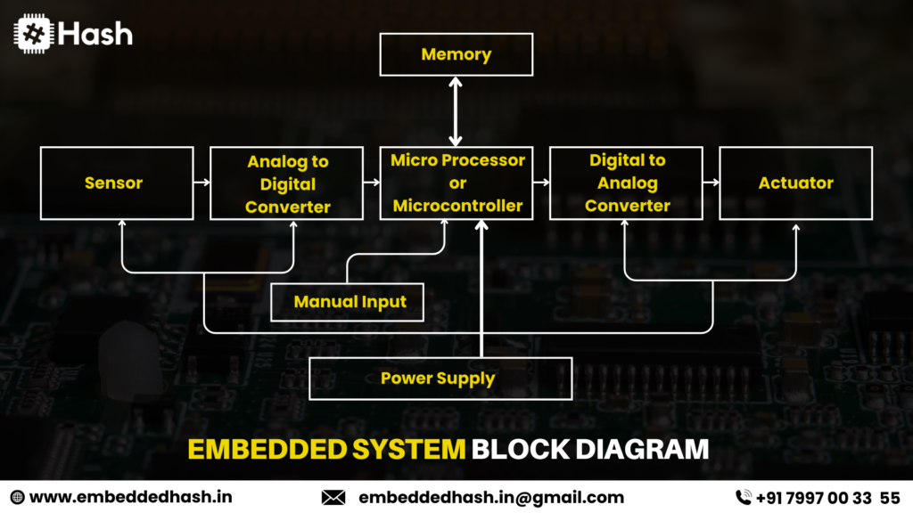
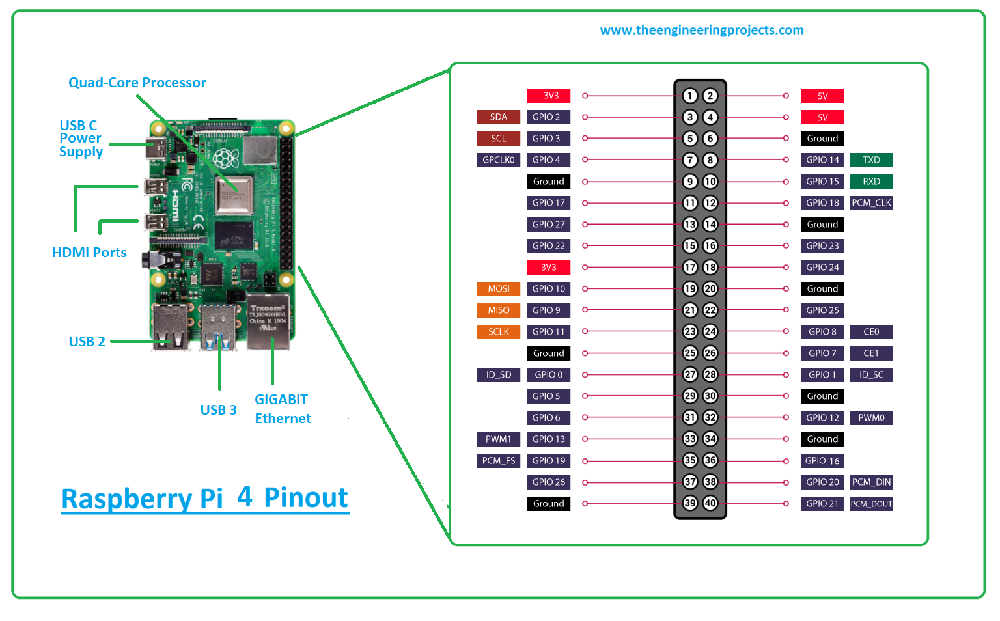
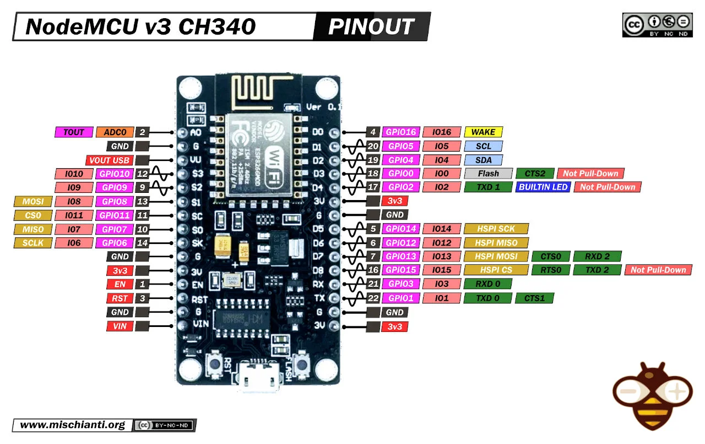
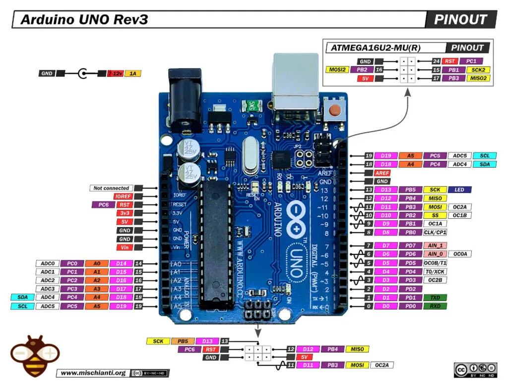
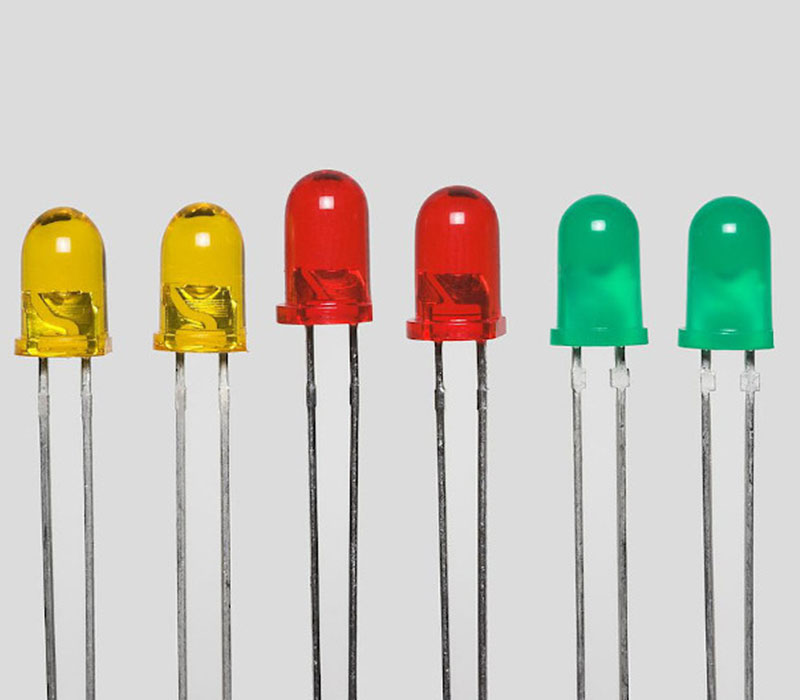
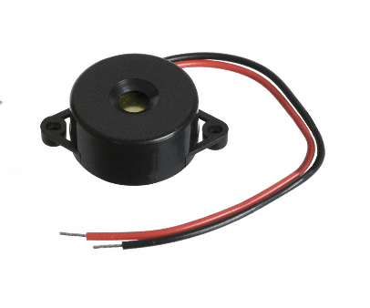

# Lab 4: Familiarization with Sensors, Actuators, and Embedded Systems

## 1. Title: **Familiarization with Sensors, Actuators, and Embedded Systems**

## 2. Objectives
- Understand the basic architecture of embedded systems used in IoT.
- Become familiar with commonly used sensors and actuators.
- Identify the features, functions, and pin configuration of the **Raspberry Pi**.
- Identify the features, functions, and pin configuration of the **ESP32**.
- Identify the features, functions, and pin configuration of the **ESP8266**.
- Identify the features, functions, and pin configuration of the **Arduino Uno**.

## 3. Introduction
An **embedded system** is a combination of hardware and software designed to perform a specific, dedicated function within a larger system. Unlike general-purpose computers, embedded systems are optimized for particular tasks such as reading sensor data, controlling actuators, or managing communication between devices.

In the context of **IoT (Internet of Things)**, embedded systems form the "brain" of every smart device. A microcontroller board — such as an Arduino, ESP32, ESP8266, or a single-board computer like the Raspberry Pi — receives input from sensors, processes this information according to programmed logic, and produces output through actuators or network communication.

  
   
  <em>Figure 1: Embedded System Block Diagram</em>

**Basic Embedded IoT Data Flow:**
Sensor (Input) → Microcontroller/Microprocessor (Processing) → Actuator / Network (Output)

## 4. Background Theory

### 4.1 Embedded Systems
An embedded system combines a processor (microcontroller or microprocessor), memory, input/output interfaces, and firmware to carry out a defined task. Key characteristics include:
- **Real-time operation:** Many embedded systems must respond to events within strict timing constraints.
- **Dedicated functionality:** Built for a specific purpose rather than general computing.
- **Resource constraints:** Limited processing power, memory, and power supply compared to desktop computers.
- **Reliability:** Expected to run continuously, often unattended, for long periods.

Embedded systems in IoT typically fall into two categories:
- **Microcontroller-based boards** (Arduino Uno, ESP32, ESP8266) – these run a single program in a loop and directly control GPIO pins.
- **Microprocessor-based boards** (Raspberry Pi) – these run a full operating system (e.g., Raspberry Pi OS) and can multitask, making them suitable for more computation-heavy tasks like image processing or hosting a local server.

### 4.2 Microcontrollers and Microprocessors for IoT

#### A. Raspberry Pi
The Raspberry Pi is a low-cost, credit-card-sized single-board **computer** capable of running a full Linux-based operating system. It is best suited for IoT applications that need networking, storage, or computation beyond simple sensor reading — such as edge AI, local dashboards, or camera-based systems.

**Key Specifications (Raspberry Pi 4 Model B):**
| Feature | Specification |
|---|---|
| Processor | Broadcom BCM2711, Quad-core Cortex-A72 (ARM v8) @ 1.5 GHz |
| RAM | 2 GB / 4 GB / 8 GB LPDDR4 |
| Connectivity | Dual-band 2.4/5.0 GHz Wi-Fi, Bluetooth 5.0, Gigabit Ethernet |
| USB Ports | 2× USB 3.0, 2× USB 2.0 |
| Display | 2× Micro-HDMI (supports dual 4K displays) |
| GPIO Header | 40-pin header (28 usable GPIO lines, 26 general-purpose) |
| Power Input | USB Type-C |
| Operating System | Raspberry Pi OS (Debian-based Linux) |

**Pin Configuration Overview:**
The Raspberry Pi 4 has a standard 40-pin GPIO header consisting of:
- 2× 5V power pins and 2× 3.3V power pins
- 8 ground (GND) pins
- 26 general-purpose GPIO pins supporting digital I/O, PWM (software on all pins; hardware PWM on GPIO12, 13, 18, 19), SPI, I2C, and UART communication
- All GPIO pins operate at **3.3V logic** — connecting a 5V signal directly to a GPIO pin can permanently damage the board.

  
   
  <em>Figure 2: Raspberry Pi 4 GPIO Pinout</em>

#### B. ESP32
The ESP32 is a low-cost, low-power System-on-Chip (SoC) with integrated Wi-Fi and Bluetooth, developed by Espressif Systems. It is widely used in IoT projects that need wireless connectivity along with more processing power and I/O than the ESP8266.

**Key Specifications:**
| Feature | Specification |
|---|---|
| Processor | Dual-core Xtensa LX6 @ up to 240 MHz |
| Connectivity | Wi-Fi (802.11 b/g/n) + Bluetooth (Classic + BLE) |
| GPIO Pins | Up to 34 usable GPIO pins (of 48 total on the chip) |
| ADC | 2× 12-bit SAR ADC, up to 18 channels |
| DAC | 2× 8-bit DAC channels (GPIO25, GPIO26) |
| PWM | 16 independent PWM (LEDC) channels, assignable to almost any GPIO |
| Communication | 3× SPI, 3× UART, 2× I2C, 2× I2S |
| Touch Sensing | 10 capacitive touch-enabled GPIOs |
| Operating Voltage | 3.3V |

**Pin Configuration Overview:**
On the common 30-pin ESP32 DevKit V1 board, pins are grouped by function: power (3V3, 5V/VIN, GND), general GPIO, ADC-only input pins (GPIO34–39, no pull-up/down and input-only), dedicated DAC pins (GPIO25, GPIO26), and strapping pins (GPIO0, 2, 12, 15) that affect boot mode and should be used carefully. Thanks to pin multiplexing, most peripheral functions (UART, SPI, I2C, PWM) can be reassigned to almost any GPIO in software.

  
   
  <em>Figure 3: ESP32 DevKit Pinout</em>

#### C. ESP8266
The ESP8266 is Espressif's earlier and simpler Wi-Fi SoC, most commonly used through the **NodeMCU** development board. It is cheaper and smaller than the ESP32 but lacks Bluetooth and has far fewer usable GPIO pins.

**Key Specifications (NodeMCU ESP8266, ESP-12E module):**
| Feature | Specification |
|---|---|
| Processor | Tensilica L106 32-bit RISC @ 80–160 MHz |
| Connectivity | Wi-Fi (802.11 b/g/n), no Bluetooth |
| RAM / Flash | 128 KB RAM, 4 MB Flash |
| GPIO Pins | 17 total, only about 11 recommended for general use |
| Analog Input | 1 pin (A0), 0–3.3V range |
| Communication | 2× UART, 1× SPI (HSPI), software I2C (no hardware I2C) |
| PWM | 4 PWM-capable pins (GPIO4, 12, 14, 15) |
| Operating Voltage | 3.3V |

**Pin Configuration Overview:**
The silkscreen labels (D0–D8) on a NodeMCU board do **not** match the underlying GPIO numbers — for example, D0 is GPIO16 and D1 is GPIO5 — which is a common source of confusion for beginners. Pins GPIO6–GPIO11 are internally connected to the onboard flash memory and must not be used. GPIO0, GPIO2, and GPIO15 are boot/strapping pins that need specific states at power-up.

  
   
  <em>Figure 4: NodeMCU ESP8266 Pinout</em>

#### D. Arduino Uno
The Arduino Uno is an 8-bit microcontroller board built around the ATmega328P chip. It has no built-in networking, so IoT projects typically pair it with an external Wi-Fi/Ethernet/GSM module. It remains one of the most beginner-friendly boards for learning embedded fundamentals.

**Key Specifications (Arduino Uno R3):**
| Feature | Specification |
|---|---|
| Microcontroller | ATmega328P (8-bit AVR) @ 16 MHz |
| Digital I/O Pins | 14 (6 support PWM: pins 3, 5, 6, 9, 10, 11) |
| Analog Input Pins | 6 (A0–A5), 10-bit ADC |
| Flash / SRAM / EEPROM | 32 KB / 2 KB / 1 KB |
| Communication | UART (pins 0/1), SPI (ICSP header), I2C (A4/SDA, A5/SCL) |
| Operating Voltage | 5V |
| Input Voltage (recommended) | 7–12V via barrel jack or Vin |

**Pin Configuration Overview:**
Digital pins 0 (RX) and 1 (TX) are reserved for serial communication; pin 13 has a built-in LED for quick testing. Analog pins A0–A5 can also be used as extra digital pins. Unlike the ESP32/ESP8266/Raspberry Pi, the Arduino Uno's I/O pins operate at **5V logic**, so a level shifter is required when interfacing with 3.3V devices.

  
   
  <em>Figure 5: Arduino Uno Pinout</em>

### 4.3 Comparison of the Four Boards
| Parameter | Raspberry Pi 4 | ESP32 | ESP8266 | Arduino Uno |
|---|---|---|---|---|
| Type | Microprocessor (runs OS) | Microcontroller (SoC) | Microcontroller (SoC) | Microcontroller |
| Built-in Wi-Fi | Yes | Yes | Yes | No |
| Built-in Bluetooth | Yes | Yes | No | No |
| Logic Voltage | 3.3V | 3.3V | 3.3V | 5V |
| Usable GPIO | 26 | ~34 | ~11 | 14 digital + 6 analog |
| Typical Use in this Project | Heavier processing tasks, hosting servers | Wireless sensor nodes | Simple, low-cost wireless nodes | Simple sensor/actuator interfacing |

### 4.4 Sensors

A **sensor** converts a physical quantity into an electrical signal that a microcontroller can read.

---

## 1. DHT11 / DHT22

**Description:**  
Digital temperature and humidity sensors commonly interfaced through a single digital pin using a timing-based protocol.

### Image

  

---

## 2. Light Sensor (LDR)

**Description:**  
A photoresistor whose resistance decreases as light intensity increases. It is usually connected through a voltage divider and read using an analog input pin.

### Image

  

---

## 3. Soil Moisture Sensor

**Description:**  
Uses two probes to measure the electrical resistance of soil, producing an analog voltage proportional to the moisture level. Widely used in smart agriculture.

### Image

  

---

## 4. Ultrasonic Distance Sensor (HC-SR04)

**Description:**  
Emits an ultrasonic pulse and measures the echo return time to calculate the distance to an object.

### Image

  

---

## 5. Gas Sensor (MQ Series)

**Description:**  
Detects the concentration of gases such as LPG, smoke, and air pollutants by measuring changes in sensor resistance when exposed to target gases.

### Image

  

---

# 4.5 Actuators

An **actuator** converts an electrical signal from the microcontroller into a physical action.

---

## 1. LEDs

**Description:**  
Simple indicators controlled using digital HIGH/LOW signals or dimmed using PWM.

### Image

  

---

## 2. Buzzers

**Description:**  
Produce sound for alerts and notifications. They may be active or passive depending on the driving method.

### Image

  

---

## 3. Servo Motors

**Description:**  
Rotate to a specific angle using PWM control signals and are commonly used for precise positioning.

### Image

  

---

## 4. DC Motors

**Description:**  
Provide continuous rotational motion and are typically controlled using a motor driver such as the L298N because microcontroller pins cannot supply sufficient current.

### Image

  

---

## 5. Relay Modules

**Description:**  
Electrically controlled switches that enable a low-voltage microcontroller to safely control high-voltage or high-current appliances.

### Image

  

## 5. Procedure
1. Studied the architecture and characteristics of embedded systems relevant to IoT.
2. Examined the datasheets and pinout diagrams of the Raspberry Pi, ESP32, ESP8266, and Arduino Uno.
3. Compared the four boards based on processing power, connectivity, GPIO count, and logic voltage.
4. Identified commonly used IoT sensors (DHT11/DHT22, LDR, soil moisture, ultrasonic, gas sensor) and their working principles.
5. Identified commonly used IoT actuators (LEDs, buzzers, servo motors, DC motors, relay modules) and their control requirements.
6. Prepared summarized notes and comparison tables for future reference in hardware selection.
7. Carried out research on real-world IoT projects to understand practical applications of these boards, sensors, and actuators.

## 6. Research Work: 10 IoT Projects

 S.N | Project Title | Description | Reflection | Resource |
|-----|--------------|-------------|------------|----------|
| 1 | Smart Home Automation | Controls appliances remotely using Wi-Fi. | Learned remote monitoring and automation. | https://randomnerdtutorials.com |
| 2 | Smart Irrigation System | Automatically waters plants based on soil moisture. | Understood IoT in agriculture. | https://iotdesignpro.com |
| 3 | Weather Monitoring Station | Measures environmental conditions. | Learned cloud-based monitoring. | https://projects.raspberrypi.org |
| 4 | Smart Parking System | Detects available parking spaces. | Learned ultrasonic sensor applications. | https://create.arduino.cc/projecthub |
| 5 | Flood Monitoring System | Detects water level and sends alerts. | Learned disaster monitoring using IoT. | https://circuitdigest.com |
| 6 | Air Quality Monitoring | Detects harmful gases using MQ sensors. | Understood environmental monitoring. | https://www.instructables.com |
| 7 | Smart Street Lighting | Automatically controls street lights using LDR. | Learned energy-efficient lighting systems. | https://electronicsforu.com |
| 8 | Smart Door Lock | Uses RFID/Fingerprint authentication. | Learned IoT security concepts. | https://maker.pro |
| 9 | Smart Dustbin | Opens automatically using ultrasonic sensors. | Learned touchless automation. | https://www.hackster.io |
| 10 | Health Monitoring System | Monitors body temperature and heart rate. | Learned wearable IoT applications. | https://www.electronicshub.org |

---

## 7. Output
- Clear understanding of embedded system architecture in the context of IoT.
- Familiarity with the features, specifications, and pin configurations of the Raspberry Pi, ESP32, ESP8266, and Arduino Uno.
- Ability to select the right board for a given IoT task based on connectivity, processing power, and GPIO requirements.
- Understanding of common IoT sensors and actuators and how they interface with a microcontroller.
- Exposure to 10 real-world IoT projects and the design lessons they offer.

## 8. Conclusion
This lab provided a foundational understanding of embedded systems and the hardware building blocks used throughout IoT development. By comparing the Raspberry Pi, ESP32, ESP8266, and Arduino Uno side by side, it became clear that board selection is a trade-off between processing power, wireless connectivity, GPIO availability, and logic voltage compatibility — the "right" board depends entirely on what the application needs to do. Studying commonly used sensors (DHT11/DHT22, LDR, soil moisture, ultrasonic, gas sensors) and actuators (LEDs, buzzers, servo/DC motors, relays) clarified how physical-world data is captured and acted upon in a typical embedded IoT pipeline. Finally, reviewing ten real-world IoT projects connected this theory to practical, working systems and offered several design lessons — such as building offline fallbacks, using threshold-based alerting, and matching board complexity to task complexity — that are directly transferable to the Smart Academic Management System project.